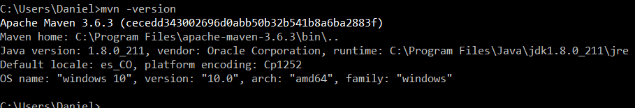
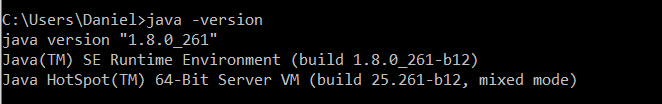
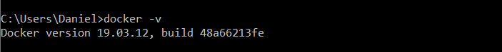
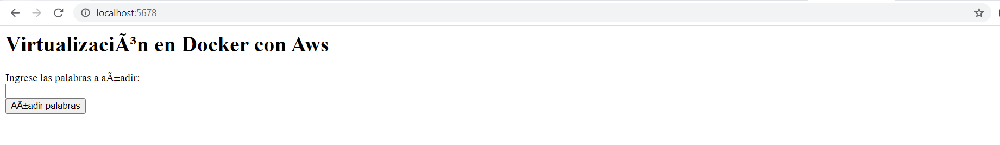
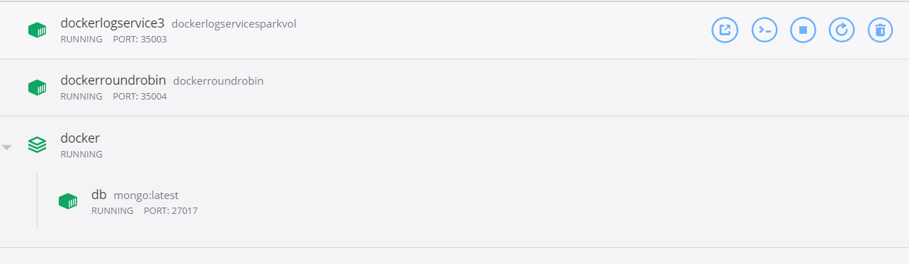
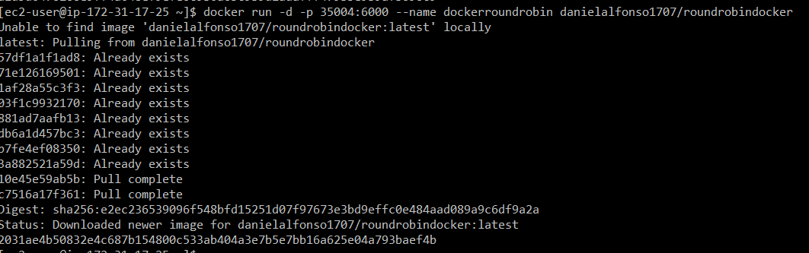
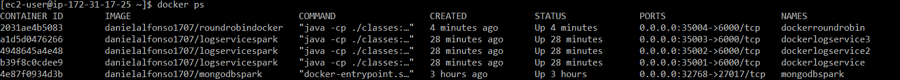
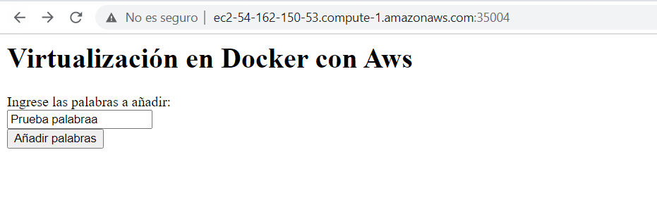
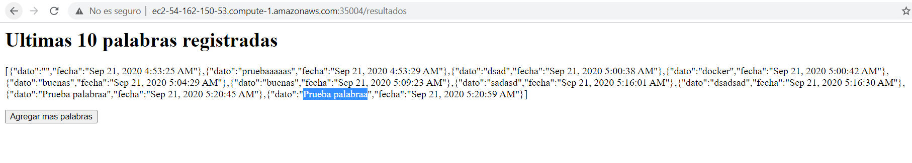

# Autor: Daniel Felipe Alfonso Bueno
# Profesor: Luis Daniel Benavides
# AREP - Arquitectura Empresarial
## Taller de de modularización con virtualización e Introducción a Docker y a AWS

### Prerrequisitos 
#### Mvn

#### Java

#### Docker

Además haremos uso de Git para la creación y gestión de repositorios

### Diseño 
La descripción del diseño se encuentra en el archivo [AREPDesign.pdf](https://github.com/DanielAlfonso17/AREP-LAB5/blob/master/AREPDesign.pdf)

### Uso del proyecto
Primero debemos clonar nuestro repositorio de la siguiente dirección
https://github.com/DanielAlfonso17/AREP-LAB5.git desde la terminal de comandos

~~~
git clone https://github.com/DanielAlfonso17/AREP-LAB5.git
~~~

Podemos compilar el proyecto de la siguiente manera 
~~~
mvn package ó mvn clean install
~~~

Podremos ejecutar localmente nuestro proyecto con el siguiente comando que 
ejecuta la clase principal RoundRobin

~~~
java -cp target/classes;target/dependency/* edu.escuelaing.arep.docker.main.RoundRobin
~~~
Como resultado obtendremos 

Podemos generar la documentación de nuestro proyecto en las carpetas RoundRobin
y LogService
~~~
mvn javadoc:javadoc
~~~
La documentación se encontrara en la carpeta raíz del proyecto con el nombre de 
DocumentacionRoundRobin.html y DocumentacionLogService.html

### Generación de imagenes 
Primero generamos nuestras imágenes para subirlas localmente a nuestro docker
de la siguiente manera. Con el archivo docker-compose.yml generamos la 
imagen de la base de datos con el siguiente comando 
~~~
docker-compose up -d
~~~
Para generar la imagen de los dos proyectos (RoundRobin y LogService)
Se necesita el archivo Dockerfile y se ejecuta el siguiente comando para construirla
Respectivamente en cada carpeta del proyecto
~~~
docker build --tag dockerlogservicesparkvol .
~~~

~~~
docker build --tag dockerroundrobin .
~~~

#### Creación de container local 
Con el siguiente comando crearemos las instancias de la aplicación en 
docker localmente
 
~~~
docker run -d -p 35003:6000 --name dockerlogservice3  dockerlogservicesparkvol
~~~

~~~
docker run -d -p 35003:6000 --name dockerroundrobin  dockerroundrobin
~~~
Como resultado obtenemos en nuestro docker 

#### Creación de imágenes en DockerHub

Primero debemos crear un repositorio de docker para almacenar las imágenes en este caso creamos 
tres repositorios uno para la base de datos, para la aplicación de log service
y otro para roundrobin.

Para subir nuestra imagen debemos generar una referencia a la imagen con el nombre del repositorio de la 
siguiente manera 

~~~
docker tag dockerroundrobin danielalfonso1707/roundrobindocker
~~~
Una vez creada la referencia, solo debemos hacer push al repositorio de la siguiente manera

~~~
docker push danielalfonso1707/roundrobindocker
~~~

#### Creación de container docker en máquina virtual
Previamente debemos instalar docker en nuestra instancia de 
máquina virtual. Aquí solamente debemos correr nuestra imagen que subimos
al repositorio de docker hub de la siguiente manera

### AWS

La instancia principal de la Aplicación es decir RoundRobin se encuentra desplegada en la siguiente 
dirección en el puerto 350004

[RoundRobin](http://ec2-54-162-150-53.compute-1.amazonaws.com:35004/)
~~~
http://ec2-54-162-150-53.compute-1.amazonaws.com:35004/
~~~

Las instancias de LogService se encuentran en 

~~~
http://ec2-54-162-150-53.compute-1.amazonaws.com:35001/
http://ec2-54-162-150-53.compute-1.amazonaws.com:35002/
http://ec2-54-162-150-53.compute-1.amazonaws.com:35003/
~~~

La base de datos se encuentra en el puerto 32768 en la misma instancia de máquina virtual 
~~~
http://ec2-54-162-150-53.compute-1.amazonaws.com:32768/
~~~ 

Podemos ver los contenedores que están desplegados en nuestra maquina 

Como resultado de nuestra aplicación obtenemos, el siguiente formulario 
donde prodremos ingresar mas palabras

Al hacer submit de las palabras nos dirige a la vista de palabras agregadas 

